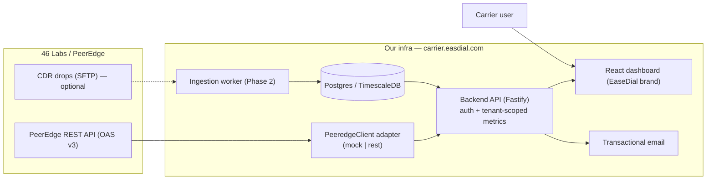

# EaseDial Carrier Portal — Architecture

## Context

`dialphone.peeredge.com` (operational switch dashboard) and
`carrier-dialphone.peeredge.com` (carrier reporting portal) are tenant instances on
**46 Labs' PeerEdge** platform. 46 Labs is the vendor and controls the `peeredge.com`
domain and application. We cannot create `carrier-easdial.peeredge.com` ourselves.

**Decision:** build an independent, self-hosted EaseDial portal on our own domain
(`carrier.easdial.com`) that consumes the same metrics through the **PeerEdge REST API
(OAS v3)** — the officially supported, contract-safe data path. We never scrape the portal
or reuse carrier login credentials.

## System diagram

## Key design choices

**Adapter seam (the whole point).** All Peeredge access goes through the `PeeredgeClient`
interface. `MockPeeredgeClient` generates realistic data so the app runs with zero
credentials; `RestPeeredgeClient` is the real implementation, selected by `PEEREDGE_SOURCE=rest`.
Nothing above the adapter knows or cares which is active — SOLID dependency inversion.

**Metric parity.** To match Peeredge's numbers exactly we consume their *aggregated
reporting endpoints* rather than recomputing from CDRs. Note the source portal reports in
**GMT**; all timestamps are stored and served in UTC and rendered per the viewer.

**Tenancy.** Every metrics query is scoped by `relationshipId` derived from the
authenticated user's claims — a carrier can only ever see their own termination data.

**Own auth lifecycle.** Admin creates a carrier user (invite) → branded email with a
single-use token → carrier sets password → login issues a JWT. This reproduces the
"email → reset → dashboard" flow you saw, but on infrastructure we control.

## Security checklist

- Secrets only via env / secrets manager; `.env` is git-ignored. No credentials in code.
- Passwords hashed with bcrypt (cost 12). Invite/reset tokens are single-use, hashed at rest, TTL-bound.
- JWT signed with `JWT_SECRET`; short access-token TTL. (Refresh rotation = Phase 2.)
- All request bodies validated with Zod before use.
- CORS locked to the portal origin; security headers via `@fastify/helmet`.
- **Action item from kickoff:** rotate the Peeredge password exposed in the shared
  screenshot and move admin creds out of the personal Google password manager.

## Data model (Phase 1)

- `users` — id, email, relationship_id, brand, password_hash, status, timestamps.
- `auth_tokens` — id, user_id, token_hash, purpose(invite|reset), expires_at, used_at.
- `metric_snapshots` (Phase 2 ingestion) — relationship_id, metric, ts, value, granularity.

See `db/migrations/001_init.sql`.
